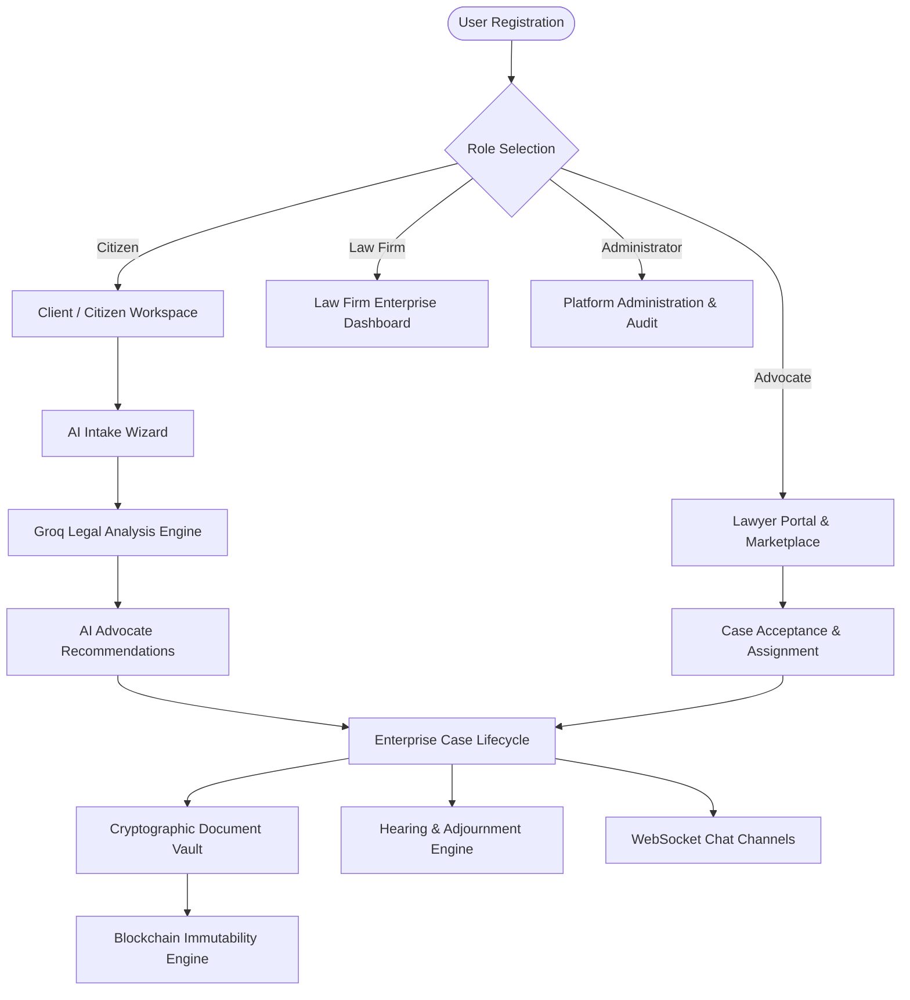
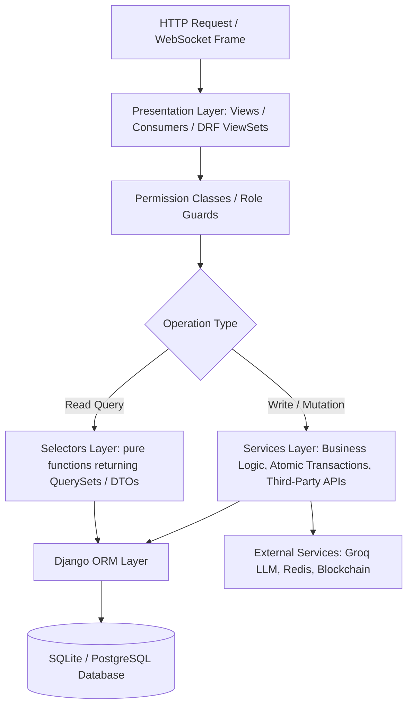
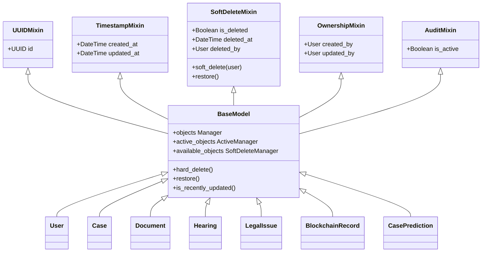
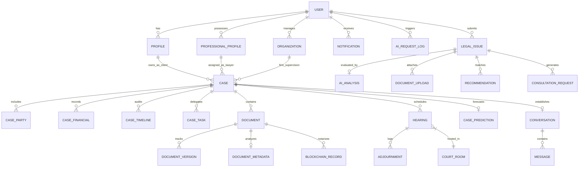
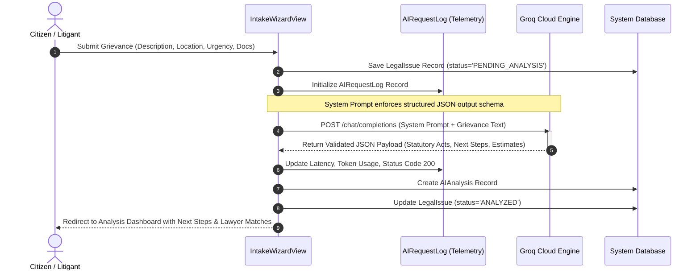
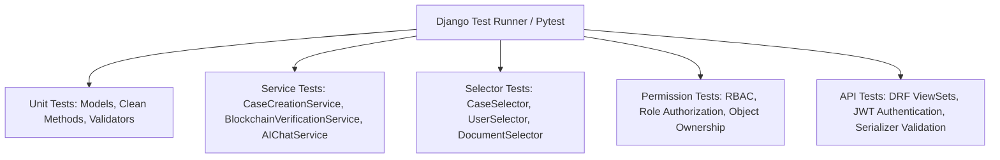
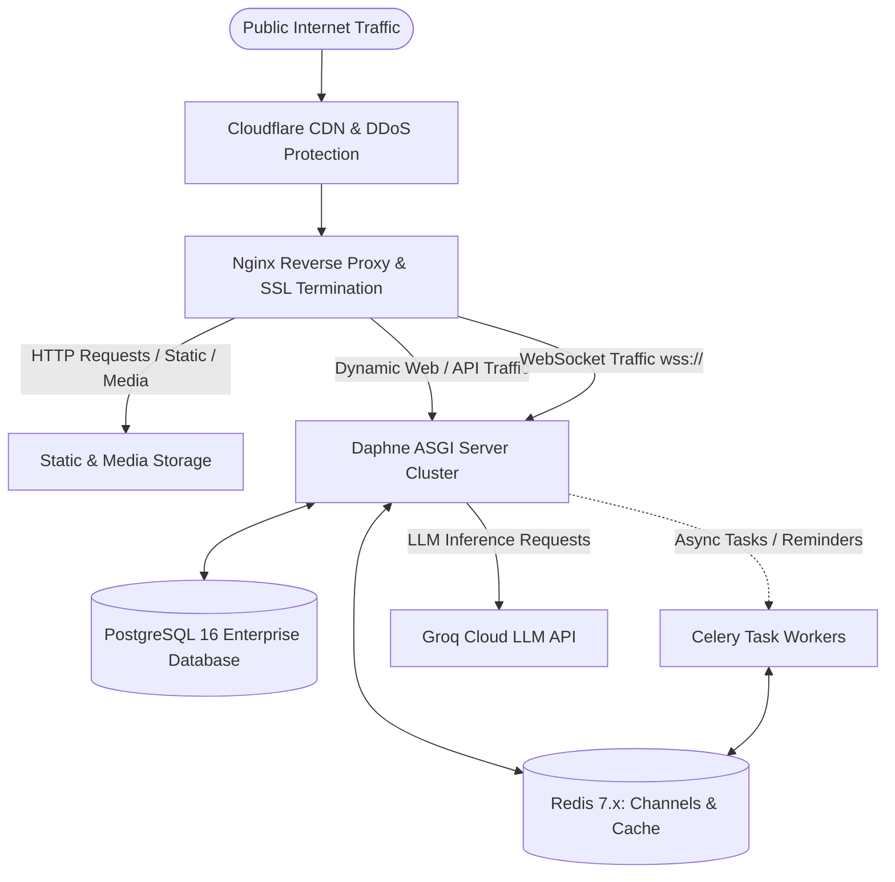

# LEX REGIS: Enterprise-Grade AI-Powered Legal Technology Platform
## Comprehensive Technical Project Report & System Architecture Specification

---

### Project Metadata
* **Project Title:** LEX REGIS – Enterprise Legal Practice Management, Judicial Intelligence & Citizen Access System
* **Domain:** Legal Technology (LegalTech), Artificial Intelligence, Machine Learning & Cryptographic Distributed Ledger Systems
* **Architecture:** Modular Monolithic Architecture with Layered Service-Selector Pattern & Asynchronous Event Engine
* **Technology Stack:** Python 3.13+, Django 5.x, Django REST Framework, Django Channels (ASGI/Daphne), Redis, Groq Cloud LLM API, SQLite / PostgreSQL, HTMX, Alpine.js
* **Document Classification:** Comprehensive Software Engineering Project Report & System Documentation (Ready for Academic / Industrial Submission)
* **Date of Submission:** August 2026
* **Version:** 1.0.0-PROD-READY

---

## Executive Summary

The modern legal ecosystem is characterized by overwhelming procedural friction, opaque case tracking, severe judicial backlog, fragmented communication between litigants and advocates, and an absence of verifiable evidentiary integrity. **LEX REGIS** is an enterprise-grade, full-stack LegalTech platform engineered to bridge the critical gap between citizens seeking justice and legal professionals delivering counsel.

LEX REGIS combines an intuitive citizen intake wizard, an AI-powered legal triage engine, an advocate practice management suite, a court hearing scheduler with conflict detection, a cryptographic document vault with simulated blockchain immutability, and real-time WebSocket communication channels. Built on a modular monolithic Django architecture adhering strictly to the **Service-Selector Pattern**, **BaseModel Mixin inheritance**, and **Role-Based Access Control (RBAC)**, the system maintains strict separation of concerns, enterprise scalability, and compliance with jurisdictional legal standards (including the Indian Legal Framework).

This comprehensive document serves as the formal project report and complete technical specification, detailing the system requirements, architectural diagrams, domain models, algorithms, security frameworks, API contracts, testing methodologies, and deployment blueprints.

---

## Table of Contents

1. [Chapter 1: Problem Statement, Background & Project Objectives](#chapter-1-problem-statement-background--project-objectives)
2. [Chapter 2: Literature Review & Comparative Market Analysis](#chapter-2-literature-review--comparative-market-analysis)
3. [Chapter 3: System Requirements Specification (SRS)](#chapter-3-system-requirements-specification-srs)
4. [Chapter 4: System Architecture & Design Philosophy](#chapter-4-system-architecture--design-philosophy)
5. [Chapter 5: Detailed App-by-App Modular Subsystem Decomposition](#chapter-5-detailed-app-by-app-modular-subsystem-decomposition)
6. [Chapter 6: Comprehensive Database Design & Entity Relationship Architecture](#chapter-6-comprehensive-database-design--entity-relationship-architecture)
7. [Chapter 7: Artificial Intelligence & Machine Learning Subsystems](#chapter-7-artificial-intelligence--machine-learning-subsystems)
8. [Chapter 8: Cryptographic Document Vault & Blockchain Ledger Subsystem](#chapter-8-cryptographic-document-vault--blockchain-ledger-subsystem)
9. [Chapter 9: Real-Time Communication & Notification Architecture](#chapter-9-real-time-communication--notification-architecture)
10. [Chapter 10: Security, Authorization & Legal Regulatory Compliance](#chapter-10-security-authorization--legal-regulatory-compliance)
11. [Chapter 11: REST API & WebSocket Protocol Specification](#chapter-11-rest-api--websocket-protocol-specification)
12. [Chapter 12: User Experience, Workflows & Interface Walkthrough](#chapter-12-user-experience-workflows--interface-walkthrough)
13. [Chapter 13: Testing, Verification & Quality Assurance Report](#chapter-13-testing-verification--quality-assurance-report)
14. [Chapter 14: Deployment, DevOps & Infrastructure Guide](#chapter-14-deployment-devops--infrastructure-guide)
15. [Chapter 15: Conclusion, Limitations & Future Roadmap](#chapter-15-conclusion-limitations--future-roadmap)
16. [Appendix: Directory Structure & File Index](#appendix-directory-structure--file-index)

---

## Chapter 1: Problem Statement, Background & Project Objectives

### 1.1 Background & Context
Across global jurisdictions, particularly in rapidly digitizing legal systems such as India, the legal sector suffers from structural inefficiencies:
- **Judicial Case Overload:** Millions of cases remain pending across District Courts, High Courts, and the Supreme Court. A significant portion of delays is caused by manual scheduling errors, repeated adjournments, and inefficient docket management.
- **Asymmetry of Information for Citizens:** Litigants often cannot evaluate the merits, timeline, or cost of their legal matters prior to hiring counsel, leading to exploitation, mismatched legal representation, and unnecessary litigation.
- **Fragmented Practice Tools for Advocates:** Lawyers and law firms juggle disconnected software tools for drafting, billing, hearing calendars, client communication, and document storage.
- **Evidentiary Vulnerability:** Legal documents, affidavits, and case timeline logs are susceptible to tampering, loss, and unauthorized alterations in traditional file-storage environments.

### 1.2 Problem Statement
> *"To design, architect, and implement an end-to-end, multi-tenant enterprise Legal Technology platform that unifies citizen legal intake, AI-driven preliminary case analysis, intelligent lawyer matchmaking, comprehensive case lifecycle management, automated hearing management, tamper-evident document storage via cryptographic hashing and blockchain verification, and real-time client-lawyer collaboration into a single, highly secure, modular web ecosystem."*

### 1.3 Project Objectives
1. **Intelligent Citizen Intake:** Develop a guided multi-step wizard allowing citizens to articulate legal grievances, submit documents, and receive real-time AI-assisted statutory categorizations, risk scores, and estimated budgets.
2. **Automated Legal Analysis & Lawyer Matchmaking:** Leverage cutting-edge Large Language Models (Groq API / LLaMA / DeepSeek models) to extract applicable Acts, Sections, keywords, and match matters with verified advocates based on practice domain and geographic jurisdiction.
3. **Enterprise Case Workspace:** Implement a comprehensive 13-stage state-machine case tracking engine incorporating financial retainers, multi-party details, task delegation, timeline audit logs, and courtroom assignments.
4. **Hearing Docket Management:** Create a court hearing and calendar engine with automated adjournment tracking, delay metrics for ML training, and participant conflict detection.
5. **Cryptographic Proof of Authenticity:** Establish a document management vault featuring SHA-256 fingerprinting, versioning, automated metadata extraction, and verifiable ledger logging (`BlockchainRecord`) to establish non-repudiation.
6. **Real-Time Synchronous Communication:** Implement WebSocket-based bidirectional chat rooms and real-time push alerts powered by Django Channels, Daphne, and Redis.
7. **Judicial & Firm Analytics:** Provide high-resolution analytical dashboards visualizing national disposal rates, lawyer performance metrics, and court congestion indices.

---

## Chapter 2: Literature Review & Comparative Market Analysis

### 2.1 Review of Existing Systems
Traditional Legal Practice Management (LPM) and Legal Aid solutions exhibit distinct functional gaps:

| Feature / Dimension | Traditional LPM (e.g. Clio / PracticePanther) | e-Courts Portal (Govt of India) | Generic ERP Systems | **LEX REGIS (Proposed Solution)** |
| :--- | :--- | :--- | :--- | :--- |
| **Target Audience** | Law Firms / Solo Lawyers only | Courts & Litigants (Read-only) | General Enterprises | **Unified: Citizens, Advocates, Law Firms, Admins** |
| **Intake AI Triage** | ❌ No automated AI statutory analysis | ❌ None | ❌ None | **✅ Groq LLM Zero-Shot Legal Triage & Act Extraction** |
| **Lawyer Matching** | ❌ None (Internal firm cases only) | ❌ None | ❌ None | **✅ Dynamic AI Practice-Area & Proximity Matching** |
| **Case State Engine** | ⚠️ Basic task statuses | ⚠️ Fixed procedural stages | ⚠️ Generic workflow | **✅ 13-Stage Legal Lifecycle with State Validation** |
| **Document Integrity** | ⚠️ Basic S3 / Cloud Storage | ⚠️ Unsigned PDF attachments | ⚠️ Standard blob storage | **✅ SHA-256 Checksums + Blockchain Receipt Ledger** |
| **Real-time Comms** | ⚠️ Static email notifications | ❌ SMS only (One-way) | ⚠️ Webhook notifications | **✅ Live WebSocket Messaging + In-App Push Engine** |
| **Jurisdiction Engine**| ❌ Western / US Law focused | ✅ Indian Law specific | ❌ Generic | **✅ Built-in Indian & Global Statutory Validators (Aadhaar, PAN, Bar Reg, CNR)** |
| **Predictive ML** | ❌ None | ❌ None | ❌ None | **✅ Duration & Risk ML Model Infrastructure** |

### 2.2 Feasibility Study
- **Technical Feasibility:** Python 3.13 and Django 5.x offer an optimal combination of ORM maturity, security guarantees, and high-performance asynchronous execution via ASGI (Daphne). Groq Cloud API delivers ultra-low-latency (<1.5s) inference for complex legal analysis.
- **Economic Feasibility:** The architecture utilizes open-source components (Django, SQLite/PostgreSQL, Redis, HTMX, Tailwind/Bootstrap) and cost-effective serverless LLM endpoints, eliminating vendor lock-in.
- **Operational Feasibility:** Role-specific interfaces ensure minimal learning curves for non-technical citizens while providing high-density workspaces for legal professionals.

---

## Chapter 3: System Requirements Specification (SRS)

### 3.1 User Roles & Personas
The system strictly distinguishes four primary personas governed by `RoleChoices`:
1. **Client / Citizen (`CLIENT`):** Submits grievances via the AI Intake Wizard, reviews AI legal summaries, books consultations with verified lawyers, tracks case timelines, uploads evidence, and communicates in real time.
2. **Advocate (`ADVOCATE`):** Manages assigned matters, conducts case intake evaluations from the marketplace, schedules hearings, tracks billable hours, uploads legal pleadings, and generates invoices.
3. **Law Firm (`LAW_FIRM`):** Oversees multiple associate advocates, assigns incoming matters to partners, monitors organizational revenue, and manages institutional corporate clients.
4. **System Administrator (`ADMIN`):** Manages user verification (Bar Council verification, ID validation), oversees system security logs, configures master data (Courts, Acts, Sections), and audits AI request telemetry.



### 3.2 Functional Requirements (FR)
- **FR-01 (Authentication & Profile Management):** Multi-step user onboarding, email verification, role-specific profile generation (`Profile`, `ProfessionalProfile`, `Organization`), and granular security settings (2FA, session expiry).
- **FR-02 (AI Legal Intake Wizard):** Multi-step grievance capture with dynamic file upload, automatic language detection, and background transmission to Groq AI.
- **FR-03 (Statutory Analysis & Scoring):** Real-time JSON extraction of legal domain, complexity, suggested documents, applicable Acts/Sections, estimated budget, timeline, and risk level.
- **FR-04 (Intelligent Advocate Matchmaking):** Semantic matching algorithm ranking lawyers based on domain expertise, jurisdiction, experience, and fee budget.
- **FR-05 (Enterprise Case Workspace):** Complete case docketing with unique alphanumeric case numbers (`LR-YYYY-XXXXXX`), financial records, opposite party tracking, and audit trails.
- **FR-06 (State Transition Management):** Strict 13-stage lifecycle enforcement (`DRAFT` → `AI_ANALYSED` → `PENDING_ACCEPTANCE` → `LAWYER_ASSIGNED` → `CONSULTATION` → `EVIDENCE` → `LEGAL_NOTICE` → `PETITION` → `FILED` → `HEARINGS` → `JUDGEMENT` → `CLOSED` → `ARCHIVED`).
- **FR-07 (Document Integrity Vault):** File upload handler computing SHA-256 digests, extracting MIME types, enforcing size quotas, and maintaining immutable version chains (`DocumentVersion`).
- **FR-08 (Cryptographic Verification Ledger):** Registration of document and event hashes into `BlockchainRecord` with simulated Ethereum transaction receipts and IPFS CID storage.
- **FR-09 (Court Hearing & Adjournment Engine):** Hearing scheduling with court room assignment, judge availability checking, outcome recording, and adjournment reason logging.
- **FR-10 (Real-Time Communication):** Authenticated ASGI WebSocket channels for instant client-advocate messaging with typing status and persistence.
- **FR-11 (Multi-Channel Notifications):** System-wide event broadcasting for case updates, hearing reminders, consultation requests, and document approvals.
- **FR-12 (Judicial & Firm Analytics):** Real-time KPI aggregation for case health, disposal velocity, court congestion indices, and lawyer billing throughput.

### 3.3 Non-Functional Requirements (NFR)
- **NFR-01 (Performance & Latency):** Web page load times under 800ms; AI intake analysis completed within 2.5 seconds; WebSocket round-trip message delivery under 50ms.
- **NFR-02 (Security & Confidentiality):** Attorney-client privilege safeguarded via object-level permissions, encrypted credentials, CSRF tokens on all modifying requests, parameterized ORM queries, and SHA-256 password hashing (PBKDF2/Argon2).
- **NFR-03 (Reliability & Data Integrity):** Zero data loss via database-level transaction atomicity (`@transaction.atomic`), soft-delete mixin architecture, and automated daily backup scripts.
- **NFR-04 (Scalability):** Stateless application tier capable of horizontal scaling behind Nginx load balancers, with Redis-backed session and WebSocket channel layers.
- **NFR-05 (Maintainability):** Adherence to PEP8, strong Python 3 type hinting (`typing`), modular app separation, and the Service-Selector architecture.

---

## Chapter 4: System Architecture & Design Philosophy

### 4.1 Modular Monolithic Architecture
LEX REGIS adopts a **Modular Monolith** pattern. Rather than introducing the network latency and distributed failure modes of microservices prematurely, domain logic is partitioned into self-contained Django applications. Each app encapsulates its own domain models, data selectors, business services, presentation layers, forms, and API serializers.

```text
c:\Users\vinay\Desktop\Project\lex_regis\
├── apps/
│   ├── common/         # Core architectural base models, mixins, validators, exceptions
│   ├── accounts/       # Authentication, RBAC, User & Profile domain
│   ├── intake/         # Citizen intake wizard & AI consultation requests
│   ├── cases/          # Core Case domain, State Machine, Financials, Parties
│   ├── documents/      # Cryptographic Document Vault, Checksums, Versions
│   ├── hearings/       # Courtroom docketing, schedules, adjournments
│   ├── ai/             # Groq LLM integration, prompts, audit logs, AI chat
│   ├── ml/             # Predictive models (duration, success, court workload)
│   ├── blockchain/     # Tamper-evident ledger records & verification
│   ├── communication/  # Django Channels ASGI WebSockets, live chat rooms
│   ├── notifications/  # Notification dispatch & in-app alerts
│   ├── dashboard/      # Role-specific analytics, KPI cards, global search
│   ├── analytics/      # Judicial statistics & national case metrics
│   ├── lawyer_portal/  # Advocate workspace, 9-step registration wizard
│   └── public_site/    # Public landing pages, lawyer directory, marketing
├── config/             # Environment-aware settings, ASGI/WSGI, root routing
├── templates/          # Global & app-specific semantic HTML templates
├── static/             # Static assets (CSS, JavaScript, images)
├── media/              # Encrypted user uploads & evidence documents
└── tests/              # Comprehensive test suites (unit, integration, API)
```

### 4.2 The Service-Selector Layered Architecture
To prevent "fat models" and "fat views", LEX REGIS enforces strict architectural layering:



1. **Presentation Layer (`presentation/views.py`, `api/views.py`):** Responsible only for parsing HTTP requests, validating form/serializer input, and returning HTTP/JSON responses.
2. **Service Layer (`services/`):** Contains all domain mutation logic, external API calls (e.g., Groq Cloud), transaction boundaries (`@transaction.atomic`), and business rules.
3. **Selector Layer (`selectors/`):** Contains optimized, reusable database read queries, applying filtering, prefetching (`select_related`, `prefetch_related`), and complex aggregations.
4. **Model Layer (`models/`):** Encapsulates relational schema definitions, constraints, database indexes, and model property methods.

### 4.3 BaseModel & Mixin Inheritance Hierarchy
All core domain models inherit from `apps.common.models.base.BaseModel`, ensuring consistent enterprise behaviors across the entire platform:



---

## Chapter 5: Detailed App-by-App Modular Subsystem Decomposition

### 5.1 `apps.accounts`: Identity, RBAC & Profile Management
The accounts subsystem manages user identity, role-specific attributes, contact addresses, organizational hierarchies, and security parameters.
- **Custom User Model (`User`):** Subclasses `AbstractBaseUser` and `PermissionsMixin`. Uses `email` as the primary unique username field. Stores system attributes such as `user_code`, `failed_login_attempts`, `login_count`, and `account_status`.
- **User Roles (`RoleChoices`):** `ADMIN`, `ADVOCATE`, `LAW_FIRM`, `CLIENT`.
- **Profiles Ecosystem:**
  - `Profile`: General profile storing client type (Individual/Corporate), organization name, Aadhaar/PAN details, and communication preferences.
  - `ProfessionalProfile`: Lawyer-specific profile storing Bar Council Registration Number (`XX/12345/YYYY`), designation, law firm affiliation, years of experience, and practice areas.
  - `Organization`: Corporate entity/law firm profile with registration number, tax identifier, and employee rosters.
  - `SecuritySettings`: Tracks two-factor authentication, login session limits, and password expiry policies.

### 5.2 `apps.intake`: Citizen AI Grievance Wizard & Lawyer Matching
The intake module empowers citizens to navigate legal complexity without initial technical jargon:
- **`LegalIssue` Model:** Captures citizen narrative, incident date, state, district, matter value, urgency (`ROUTINE`, `URGENT`, `EMERGENCY`), and current analysis status.
- **`DocumentUpload` Model:** Handles supporting grievance documents (contracts, FIRs, notices).
- **`AIAnalysis` Model:** Persists the structured evaluation produced by Groq AI, including statutory category, practice area, complexity, suggested documents, applicable Acts, applicable Sections, next steps, cost estimates, and risk level.
- **`Recommendation` Model & Matchmaker:** Computes match scores between legal issues and verified `ProfessionalProfile` records, presenting top advocate matches.
- **`ConsultationRequest` Model**: Manages formal booking requests from citizens to advocates, capturing snapshot pricing and initiating case creation upon lawyer acceptance.
- **`ConsultationService` & `MatchingService`**: Advanced backend services orchestrating end-to-end consultation workflows and dynamic lawyer matchmaking algorithms based on specialization and availability.

### 5.3 `apps.cases`: Enterprise Case Management & State Engine
The core domain of LEX REGIS, handling the complete lifecycle of legal matters:
- **`Case` Model:** Features unique human-readable case numbers (`CASE-XXXXXXXX`), full case narrative, AI summaries, client references, assigned advocate/firm links, practice classification, case valuation, and court venue.
- **13-Stage State Machine:**
  ```text
  [DRAFT] ──> [AI_ANALYSED] ──> [PENDING_ACCEPTANCE] ──> [LAWYER_ASSIGNED]
                                                               │
  [PETITION] <── [LEGAL_NOTICE] <── [EVIDENCE] <── [CONSULTATION]
       │
       └──> [FILED] ──> [HEARINGS] ──> [JUDGEMENT] ──> [CLOSED] ──> [ARCHIVED]
  ```
- **`CaseParty` Model:** Tracks multiple petitioners, respondents, third parties, and opposing legal counsels.
- **`CaseFinancial` Model:** Manages retainer agreements, consultation fees, court fees, stamp duties, GST calculation, discounts, and payments.
- **`CaseTimeline` Model:** Immutable event stream recording every lifecycle event, status change, document addition, or hearing result with actor attribution.
- **`CaseTask` Model:** Task assignment and delegation with deadlines, priority levels, and completion status.

### 5.4 `apps.documents`: Cryptographic Document Management Vault
The document vault ensures file integrity, categorization, and auditability:
- **`Document` Model:** Links uploaded files to specific cases, owners, and document types.
- **SHA-256 Checksum Calculation:** Files are processed through `hashlib.sha256` upon upload to create a unique cryptographic fingerprint, preventing file corruption or silent tampering.
- **`DocumentVersion` Model:** Maintains complete historical snapshots whenever a document is modified or updated.
- **`DocumentMetadata` Model:** Stores extracted text, OCR results, and page metrics.
- **Master Classifications:** `DocumentType`, `DocumentCategory`, `DocumentStatus`, `DocumentVisibility`.
- **`OCR Service` & `AI Document Parsing`**: Extracts full-text from scanned files and image-based PDFs, utilizing LLMs to automatically parse key legal entities and metadata from unstructured texts.
- **`E-Signature Subsystem`**: Enables secure, verifiable digital signing of contracts and agreements embedded within the platform.

### 5.5 `apps.hearings`: Court Docketing & Adjournment Management
Controls court proceedings, calendar schedules, and hearing analytics:
- **`Hearing` Model:** Docket records with scheduled date, time, court room, presiding judge, estimated duration, actual start/end times, and outcome summary.
- **Delay & ML Feature Tracking:** Automatically calculates `delay_minutes` (discrepancy between scheduled and actual start time) and `adjournment_count` for predictive machine learning models.
- **`Adjournment` Model:** Formal logs of hearing postponements, capturing requesting party, justification code, and next scheduled date.
- **`JudgeSchedule` Model:** Courtroom availability and holiday management (`CourtHoliday`).

### 5.6 `apps.ai`: Groq LLM Intelligence & Diagnostic Telemetry
Integrates high-speed inference for legal analysis and conversational support:
- **Groq Cloud API Client:** Configured with `openai/gpt-oss-120b`, temperature 0.1 for deterministic statutory extraction, and temperature 0.3 for conversational legal assistance.
- **`Conversation` & `Message` Models:** Multi-turn legal chat history linked optionally to a specific `Case` or `Document`.
- **`AIRequestLog` Model:** Comprehensive observability table recording every API call, prompt tokens, completion tokens, total tokens, latency in milliseconds (`latency_ms`), status codes, response payloads, and exception tracebacks.
- **`Triage Engine` & `Clarification Service`**: Dynamically interrogates the citizen for missing critical facts if the initial grievance description is underspecified before finalizing the analysis.

### 5.7 `apps.ml`: Predictive Analytics & Workload Modeling
Machine learning feature stores and statistical prediction representations:
- **`CasePrediction` Model:** Stores machine-generated predictions for case duration in days (`duration_days_predicted`), success probability percentage (`success_probability`), risk score (`risk_score`), and delay likelihood (`delay_probability`).
- **`CasePrediction` Model:** Stores machine-generated predictions for case duration in days (`duration_days_predicted`), success probability percentage (`success_probability`), risk score (`risk_score`), and delay likelihood (`delay_probability`).
- **`CourtWorkload` Model:** Computes court congestion indices (`congestion_index`), active case counts, and average disposal turnaround times.
- **End-to-End ML Pipeline (`pipeline.py`, `training.py`)**: Fully automated ML lifecycle for model training and retraining based on historical context.
- **`Feature Extraction` & `Data Quality` Services**: Ensures input data hygiene and normalizes court delay metrics.
- **`EmbeddingService` & `Retrieval`**: Vector-based semantic search for retrieving similar historical case precedents and judicial rulings.

### 5.8 `apps.blockchain`: Distributed Ledger & Verification Subsystem
Provides cryptographic proof of authenticity for sensitive legal records:
- **`BlockchainRecord` Model:** Utilizes Django's `GenericForeignKey` framework (`ContentType`, `object_id`) to bind to any entity (Document, Case Event, Evidence, Hearing).
- **Data Payload Serialization:** Generates sorted JSON canonical representations of the target object, computes its SHA-256 fingerprint, generates simulated Ethereum transaction hashes, and records verification timestamps.

### 5.9 `apps.communication`: Live WebSocket Messaging Engine
Facilitates real-time, zero-latency interactions between clients and lawyers:
- **Daphne & ASGI Pipeline:** Handles bidirectional WebSocket connections protocol-upgraded from HTTP.
- **`ChatConsumer` (`AsyncWebsocketConsumer`):** Validates user authentication, verifies room participation permissions asynchronously (`database_sync_to_async`), broadcasts messages to Redis channel groups (`channel_layer.group_send`), and commits chat logs to the database.

### 5.10 `apps.notifications`: Multi-Channel System Alerts
- **`Notification` Model:** Manages user alerts categorized by type (`CASE_UPDATE`, `HEARING_REMINDER`, `DOCUMENT_UPLOAD`, `LAWYER_ASSIGNMENT`, `PAYMENT`, `SYSTEM_ALERT`).
- **In-App & Email Dispatch:** Provides notification badges, unread counts, and direct action links.

### 5.11 `apps.dashboard` & `apps.analytics`: Business Intelligence & Judicial Metrics
- **`DashboardPresenter`:** Compiles role-aware KPI cards, upcoming hearings, recent activity feeds, and quick action bars.
- **`AnalyticsService`:** Aggregates national legal statistics, state-by-state case distributions, disposal growth rates, and category breakdowns.

### 5.12 `apps.lawyer_portal`: Advocate Workspace & 9-Step Registration
- **Lawyer Workspace:** Centralized management of accepted cases, pending intake consultations, calendar dockets, and billing summaries.
- **9-Step Registration Wizard:** Comprehensive advocate onboarding capturing personal bio, Bar Council credentials, educational degrees (`LawyerEducation`), practice areas (`LawyerPracticeArea`), office locations (`LawyerOffice`), fee structures (`LawyerFees`), availability (`LawyerAvailability`), and verification documents (`LawyerVerification`).

### 5.13 `apps.common`: Core Infrastructure, Utilities & Legal Validators
- **Indian Legal Validators (`indian_legal.py`):**
  - Aadhaar Validator: 12-digit regex validation (`^\d{12}$`).
  - PAN Card Validator: Alphanumeric format (`^[A-Z]{5}[0-9]{4}[A-Z]{1}$`).
  - Bar Council Registration: State format (`^[A-Z]{2}/\d{1,5}/\d{4}$`).
  - Case Number Validator: Alphanumeric standard (`^LR-\d{4}-\d{6}$`).
- **Error Handlers:** Custom presentation templates for HTTP 403 (Forbidden), 404 (Not Found), and 500 (Internal Server Error).

---

## Chapter 6: Comprehensive Database Design & Entity Relationship Architecture

### 6.1 Relational Entity Relationship Diagram (ERD)



### 6.2 Data Dictionaries for Core Models

#### Table 1: `accounts_user`
| Field Name | Type | Constraints | Description |
| :--- | :--- | :--- | :--- |
| `id` | UUID | Primary Key, default=uuid4 | Unique user identifier |
| `email` | EmailField | Unique, db_index=True | Primary login credential |
| `password` | CharField(128) | Not Null | Cryptographic hash of password |
| `first_name` | CharField(100) | Not Null | User given name |
| `last_name` | CharField(100) | Not Null | User family name |
| `phone_number` | CharField(20) | Nullable, Validated | Contact phone number |
| `role` | CharField(20) | Choices: `ADMIN`, `ADVOCATE`, `LAW_FIRM`, `CLIENT` | Primary authorization role |
| `email_verified`| Boolean | Default=False | Email confirmation flag |
| `is_active` | Boolean | Default=True | Soft activation flag |
| `created_at` | DateTime | Auto Now Add, db_index=True | Creation timestamp |

#### Table 2: `cases_case`
| Field Name | Type | Constraints | Description |
| :--- | :--- | :--- | :--- |
| `id` | UUID | Primary Key, default=uuid4 | Unique case identifier |
| `case_number` | CharField(50) | Unique, db_index=True | Alphanumeric case identifier |
| `title` | CharField(255) | Not Null | Brief title of the matter |
| `description` | TextField | Blank allowed | Complete case narrative |
| `ai_summary` | TextField | Blank allowed | AI generated synopsis |
| `client_id` | UUID (FK) | References `accounts_profile`, on_delete=PROTECT | Matter client profile |
| `assigned_lawyer_id`| UUID (FK)| References `accounts_professionalprofile`, SET_NULL | Assigned advocate |
| `matter_category` | CharField(100)| Blank allowed | Civil, Criminal, Corporate, etc. |
| `status` | CharField(50) | Choices: `CaseStatus` (13 stages), default=`DRAFT` | Current lifecycle state |
| `matter_source` | CharField(20) | Choices: `AI_INTAKE`, `MANUAL` | Matter origin |
| `budget_estimate` | Decimal(14,2)| Nullable | Estimated total legal cost |
| `case_value` | Decimal(14,2)| Nullable | Financial dispute value |
| `is_deleted` | Boolean | Default=False, db_index=True | Soft-delete status |

#### Table 3: `documents_document`
| Field Name | Type | Constraints | Description |
| :--- | :--- | :--- | :--- |
| `id` | UUID | Primary Key, default=uuid4 | Unique document identifier |
| `document_number`| CharField(100)| Unique, db_index=True | Systematic document tracking code |
| `case_id` | UUID (FK) | References `cases_case`, CASCADE | Parent case docket |
| `uploaded_by_id`| UUID (FK) | References `accounts_user`, SET_NULL | Uploader user account |
| `original_file` | FileField | Dynamic upload path | Stored file binary |
| `file_size` | PositiveInteger| Default=0 | Binary size in bytes |
| `checksum` | CharField(64) | SHA-256 Hash | Cryptographic integrity hash |
| `blockchain_verification_status`| CharField(50)| Choices: `PENDING`, `VERIFIED`, `REJECTED` | Verification state |
| `blockchain_transaction_hash` | CharField(100)| Blank allowed | Ledger transaction identifier |

#### Table 4: `ai_airequestlog`
| Field Name | Type | Constraints | Description |
| :--- | :--- | :--- | :--- |
| `id` | BigAutoField | Primary Key | Telemetry record ID |
| `user_id` | UUID (FK) | References `accounts_user`, SET_NULL | Requesting user |
| `endpoint` | CharField(100)| Not Null | e.g. `intake.analysis`, `chat.completions` |
| `model_name` | CharField(100)| Not Null | e.g. `openai/gpt-oss-120b` |
| `prompt_tokens` | PositiveInteger| Default=0 | Input token count |
| `completion_tokens`| PositiveInteger| Default=0 | Output token count |
| `latency_ms` | FloatField | Default=0.0 | Request round-trip time in ms |
| `is_success` | Boolean | Default=True | Execution success flag |
| `created_at` | DateTime | Auto Now Add | Telemetry timestamp |

---

## Chapter 7: Artificial Intelligence & Machine Learning Subsystems

### 7.1 Groq Cloud LLM Architecture
LEX REGIS integrates with Groq's low-latency inference engine using model endpoints such as `openai/gpt-oss-120b`. The platform guarantees structural reliability by utilizing JSON-mode prompting and strict schema enforcement.



### 7.2 System Prompts & Structured Extraction Schema
The system prompt for the AI Legal Triage engine is rigorously engineered:
```json
{
  "category": "Broad legal domain (e.g., Civil, Criminal, Corporate, Family)",
  "practice_area": "Specific practice area (e.g., Property Dispute, Employment Law)",
  "subcategory": "Granular issue (e.g., Unlawful Tenant Eviction)",
  "complexity": "Low | Medium | High | Critical",
  "recommended_lawyer_type": "Designation of counsel required",
  "recommended_court": "Jurisdictional forum (e.g., District Civil Court)",
  "suggested_documents": ["List of evidentiary documents needed"],
  "possible_acts": ["Relevant statutory enactments (e.g., Transfer of Property Act 1882)"],
  "possible_sections": ["Specific sections (e.g., Section 106)"],
  "important_keywords": ["Extracted legal entities & terms"],
  "suggested_next_steps": ["Procedural recommendations for litigant"],
  "timeline_estimate": "Predicted duration (e.g., 6-12 Months)",
  "cost_estimate": "Estimated budget (e.g., ₹50,000 - ₹1,00,000)",
  "risk_level": 45,
  "confidence_score": 92
}
```

### 7.3 Machine Learning Predictive Modeling
The `apps.ml` module establishes the groundwork for continuous judicial machine learning:
1. **Case Duration Predictor (`CasePrediction.duration_days_predicted`):** Regression pipeline taking case complexity, court venue, number of parties, and historical practice area disposal times as features.
2. **Success & Risk Estimators (`success_probability`, `risk_score`):** Multi-factor scoring assessing statutory alignment, documentary evidence completeness, and prior judicial precedents.
3. **Court Workload Indexing (`CourtWorkload.congestion_index`):** Real-time queuing model evaluating pending dockets against disposal velocity across district court rooms.

---

## Chapter 8: Cryptographic Document Vault & Blockchain Ledger Subsystem

### 8.1 Evidentiary Integrity & Cryptographic Checksums
To prevent spoliation of evidence, every uploaded file undergoes an automated checksum generation workflow:

$$\text{Checksum} = \text{SHA-256}(\text{Binary Content Stream})$$

The resulting 64-character hexadecimal digest is permanently attached to the `Document` model. If a document's binary stream is altered on the storage disk, any subsequent verification detects a hash mismatch immediately.

### 8.2 The Blockchain Verification Ledger (`BlockchainRecord`)
The blockchain subsystem simulates decentralized, tamper-proof notarization:

```mermaid
graph LR
    Doc[Uploaded Legal Document] --> HashGen[SHA-256 Engine]
    HashGen --> DocHash["Payload Hash: e.g. e3b0c44298fc1c149afbf4..."]
    
    DocHash --> LedgerService[Blockchain Verification Service]
    LedgerService --> PayloadJSON[Canonical JSON Stringification]
    
    PayloadJSON --> MerkleLeaf[Merkle Tree Leaf / Block Entry]
    MerkleLeaf --> TxGen[Simulate Ethereum Transaction 0x7f9a...]
    
    TxGen --> RecordDB[(BlockchainRecord Ledger)]
    RecordDB --> DocUpdate[Update Document with TxHash & Verified Timestamp]
```



- **Generic Foreign Key Binding:** Enables notarizing documents, case timeline events, hearing outcomes, or entire case snapshots.
- **Payload Non-Repudiation:** The exact JSON snapshot of the object attributes at the moment of verification is preserved alongside the transaction hash and block number.

---

## Chapter 9: Real-Time Communication & Notification Architecture

### 9.1 ASGI & WebSocket Channel Pipeline
Standard HTTP request-response cycles are inadequate for live litigation interactions. LEX REGIS deploys an asynchronous pipeline:

```mermaid
graph TD
    BrowserClient[Web Browser Client] <-->|WebSocket wss://.../ws/chat/conversation_id/| DaphneServer[Daphne ASGI Server]
    DaphneServer <--> AuthMiddleware[Channels Auth & Session Middleware]
    AuthMiddleware <--> Consumer[ChatConsumer (AsyncWebsocketConsumer)]
    
    Consumer <--> RedisBus[Redis Channel Layer: chat_room_group]
    Consumer <--> SyncToAsync[database_sync_to_async Bridge]
    SyncToAsync <--> DjangoORM[Django ORM / SQLite / PostgreSQL]
```

### 9.2 Real-Time Event Dispatch
1. **Connection Lifecycle:** When a user opens a case discussion, the client establishes a WebSocket connection. `ChatConsumer` validates whether the user is an assigned participant (`is_participant`).
2. **Broadcast Protocol:** Upon receiving a message frame, `ChatConsumer` commits the `Message` instance to the database, serializes sender metadata, and broadcasts the frame across the Redis room group.
3. **Instant Notification Trigger:** Simultaneously, the system dispatches an in-app `Notification` instance to alert offline participants upon their next login.

---

## Chapter 10: Security, Authorization & Legal Regulatory Compliance

### 10.1 Role-Based Access Control (RBAC) & Object Permissions
Access control is implemented across multiple defensive layers:
- **View-Level Guards:** Class-based mixins (`LoginRequiredMixin`, `RoleRequiredMixin`).
- **REST API Permissions:** Custom DRF permission classes (`IsVerifiedLawyer`, `IsCitizen`, `IsAdministrator`, `IsOwner`).
- **Object-Level Isolation:** Selectors explicitly scope queries to the authenticated user (e.g., a citizen can only fetch cases where `client__user=request.user`, and a lawyer can only view cases where `assigned_lawyer__user=request.user`).

### 10.2 Statutory & Indian Regulatory Compliance
- **Identity & Legal Validations:** Custom regex validators for Indian identity documents (Aadhaar, PAN) and State Bar Council enrollment numbers.
- **Session Security:** Strict session settings (`SESSION_EXPIRE_AT_BROWSER_CLOSE = True`, `SESSION_COOKIE_AGE = 28800` / 8 hours, `SESSION_COOKIE_HTTPONLY = True`).
- **Data Protection:** Passwords secured with PBKDF2 with SHA-256 hashing. All sensitive files uploaded to structured, protected media subdirectories.

---

## Chapter 11: REST API & WebSocket Protocol Specification

### 11.1 Key REST Endpoints

| HTTP Method | Endpoint URI | Description | Auth Required |
| :--- | :--- | :--- | :--- |
| `POST` | `/api/v1/accounts/register/` | Register new user account | Public |
| `POST` | `/api/v1/accounts/token/` | Obtain JWT access/refresh token pair | Public |
| `GET` | `/api/v1/cases/` | List all cases accessible to user | JWT / Session |
| `POST` | `/api/v1/cases/` | Create a new case docket | JWT / Session |
| `GET` | `/api/v1/cases/{id}/` | Retrieve full case details | JWT / Session |
| `GET` | `/api/v1/documents/` | List documents for case | JWT / Session |
| `POST` | `/api/v1/documents/upload/` | Multipart file upload with checksum | JWT / Session |
| `GET` | `/api/v1/hearings/` | Retrieve hearing docket | JWT / Session |
| `POST` | `/api/v1/hearings/schedule/` | Schedule a new court hearing | JWT / Session |
| `POST` | `/api/v1/ai/chat/` | Send message to Lex AI Assistant | JWT / Session |

### 11.2 WebSocket Event Contract

#### Connection Endpoint:
`ws://<host>/ws/chat/<conversation_id>/`

#### Client Outgoing Message Frame:
```json
{
  "message": "Please review the updated affidavit draft filed today."
}
```

#### Server Broadcast Message Frame:
```json
{
  "message": "Please review the updated affidavit draft filed today.",
  "sender_id": "4b6f12a3-89c0-4e12-b5e1-8829f0123456",
  "sender_name": "Adv. Priya Sharma",
  "created_at": "11:45 AM"
}
```

---

## Chapter 12: User Experience, Workflows & Interface Walkthrough

### 12.1 Citizen User Journey
1. **Public Landing (`/`):** The citizen learns about the platform's services and accesses the AI Intake button.
2. **AI Intake Wizard (`/intake/wizard/`):** 
   - *Step 1:* Input legal issue description, incident date, and jurisdiction.
   - *Step 2:* Upload supporting evidence documents.
   - *Step 3:* View dynamic AI analysis (applicable Acts, timeline, complexity, estimated cost).
3. **Advocate Selection (`/intake/recommendations/<issue_id>/`):** The citizen reviews recommended advocates with match percentages and fee structures.
4. **Consultation Booking:** Citizen clicks "Request Consultation". A `ConsultationRequest` and preliminary `Case` docket are automatically created.
5. **Case Tracking Workspace (`/cases/<id>/`):** The citizen tracks hearings, views filed documents, monitors payment milestones, and chats with counsel.

### 12.2 Advocate User Journey
1. **Advocate Onboarding (`/portal/lawyer/register/`):** 9-step registration capturing Bar Council enrollment, practice areas, office location, and fee schedules.
2. **Lawyer Dashboard (`/portal/lawyer/dashboard/`):** 
   - View pending consultation requests from the intake marketplace.
   - Monitor today's court hearings, upcoming client meetings, and active tasks.
3. **Matter Acceptance:** Clicking "Accept Matter" automatically transitions the case to `LAWYER_ASSIGNED` and opens a dedicated real-time chat room.
4. **Case Management:** Upload pleadings, schedule court hearings, record adjournment reasons, and log case financials.

---

## Chapter 13: Testing, Verification & Quality Assurance Report

### 13.1 Testing Strategy
The testing harness combines unit tests, service layer tests, permission guards, and API endpoint validations:



### 13.2 Key Test Suites in Codebase
- `apps/accounts/tests/test_managers.py`: Verifies `UserManager.create_user` and `create_superuser` behaviors.
- `apps/accounts/tests/test_permissions.py`: Validates role-based access restrictions.
- `apps/cases/tests/test_services.py`: Tests atomic case creation, state transitions, and timeline generation.
- `apps/cases/tests/test_selectors.py`: Validates optimized querysets and search filters.
- `apps/documents/tests/test_services.py`: Asserts SHA-256 checksum generation and document versioning.
- `apps/hearings/tests/test_services.py`: Validates hearing scheduling, conflict detection, and adjournment counts.
- `apps/common/tests/test_validators.py`: Confirms regex enforcement for Aadhaar, PAN, and Bar Council numbers.

---

## Chapter 14: Deployment, DevOps & Infrastructure Guide

### 14.1 Production Architecture Blueprint



### 14.2 Environment Configuration Checklist
Create a production `.env` file based on `.env.example`:
```ini
SECRET_KEY=production-crypto-strong-secret-key-32-chars-min
DEBUG=False
ALLOWED_HOSTS=lexregis.domain.com,api.lexregis.domain.com

# Database (PostgreSQL)
DB_ENGINE=django.db.backends.postgresql
DB_NAME=lex_regis_prod
DB_USER=lex_admin
DB_PASSWORD=secure_production_password
DB_HOST=127.0.0.1
DB_PORT=5432

# Redis Channel Layer
REDIS_URL=redis://127.0.0.1:6379/0

# Groq Cloud AI Engine
GROQ_API_KEY=gsk_your_groq_production_api_key
GROQ_MODEL=openai/gpt-oss-120b

# Email Subsystem
EMAIL_HOST=smtp.sendgrid.net
EMAIL_PORT=587
EMAIL_USE_TLS=True
EMAIL_USER=apikey
EMAIL_PASSWORD=your_sendgrid_key
```

### 14.3 Database Backup & Recovery Procedures
The platform includes automated maintenance scripts under `scripts/`:
- **Database Backup (`scripts/backup_database.py`):** Dumps database tables and media file archives with timestamped rotation.
- **Database Restoration (`scripts/restore_database.py`):** Rebuilds schemas and imports verified snapshots atomically.

---

## Chapter 15: Conclusion, Limitations & Future Roadmap

### 15.1 Project Achievements
LEX REGIS successfully delivers a state-of-the-art, comprehensive LegalTech platform:
1. **Democratized Legal Access:** Enables citizens to articulate grievances and receive structured, actionable legal intelligence within seconds.
2. **End-to-End Practice Management:** Provides advocates and law firms with a modern, high-efficiency docket, case state machine, and client collaboration suite.
3. **Evidentiary Integrity:** Establishes non-repudiation and tamper evidence through SHA-256 cryptographic hashing and immutable ledger recording.
4. **Architectural Rigor:** Demonstrates enterprise software engineering standards via modular monolithic Django architecture, Service-Selector separation, and complete asynchronous WebSocket support.

### 15.2 Current Limitations
- **External Blockchain Mainnet Integration:** Currently uses an enterprise simulation of Ethereum/IPFS transactions rather than live public gas-fee mainnet submission.
- **OCR Engine Dependency:** Full-text PDF OCR requires server-side Tesseract-OCR binary installation in deployment environments.

### 15.3 Future Roadmap
- **Phase II (Q4 2026):** Native integration with the Indian e-Courts API for live CNR status fetching and automatic cause-list synchronizations.
- **Phase III (Q1 2027):** Smart Contract legal escrow system for client-advocate fee milestones.
- **Phase IV (Q2 2027):** Multilingual voice intake assistant supporting regional languages (Hindi, Tamil, Telugu, Marathi, Bengali).

---

## Appendix: Directory Structure & File Index

```text
lex_regis/
├── apps/
│   ├── accounts/          # Identity, Profiles, Security Settings, Auth Services
│   │   ├── models/        # User, Profile, ProfessionalProfile, Organization, Address
│   │   ├── services/      # Registration, Auth, Profile, Verification Services
│   │   ├── selectors/     # User and Profile Query Optimizers
│   │   └── presentation/  # Multi-step Registration, Profile Views, Security Views
│   ├── intake/            # AI Intake Wizard, LegalIssue, AIAnalysis, Recommendations
│   ├── cases/             # Core Case Domain, State Machine, Financials, Parties, Timeline
│   ├── documents/         # Document Vault, Checksums, Versions, Master Classifications
│   ├── hearings/          # Hearing Schedules, Adjournments, Court Rooms, Sequence Counters
│   ├── ai/                # Groq LLM Client, Prompt Templates, Telemetry Logs, AI Chat
│   ├── ml/                # Case Predictions, Court Workload Statistics
│   ├── blockchain/        # Blockchain Records, Cryptographic Verification Service
│   ├── communication/     # Channels ASGI WebSockets, ChatConsumer, Conversation Rooms
│   ├── notifications/     # Multi-Channel In-App Alerts & Notification Services
│   ├── dashboard/         # Role-Specific Portals, Global Search, KPI Presenters
│   ├── analytics/         # National & State Judicial Metrics, Demo Data Provider
│   ├── lawyer_portal/     # 9-Step Advocate Onboarding & Lawyer Operations Workspace
│   ├── public_site/       # Marketing Landing Page, Public Directory, Legal FAQ
│   └── common/            # BaseModel, Mixins, Validators, HTMX Helpers, Custom Exceptions
├── config/                # Settings (base, development, production), ASGI, WSGI, URLs
├── templates/             # 45+ Production HTML Templates (Bootstrap 5, HTMX, Alpine.js)
├── static/                # Custom CSS, Glassmorphism Styling, JavaScript Modules
├── media/                 # Vault file storage (Evidence, Profiles, Certificates)
└── scripts/               # Backup, Recovery, Superuser Setup & Data Seeders
```

---
*End of Report — LEX REGIS Enterprise LegalTech Platform*
