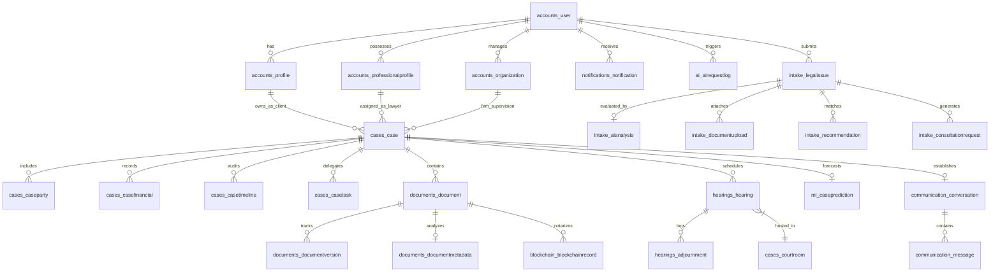

# Database Design & Relational Schema Specification
## LEX REGIS: Entity Relationship Architecture & Data Schema

---

## 1. Schema Overview

The database schema of LEX REGIS comprises over 25 distinct relational entities organized across modular domains. Primary keys across all transactional models utilize UUIDv4 identifiers, and audit fields are inherited from `BaseModel`.

---

## 2. Table Schemas & Constraints

### 2.1 Identity Domain (`apps.accounts`)
- `accounts_user`: Custom authentication table with unique email, hashed password, role choices (`ADMIN`, `ADVOCATE`, `LAW_FIRM`, `CLIENT`), login metrics, and verification flags.
- `accounts_profile`: Client profiles storing personal identifiers (Aadhaar, PAN) and organization details.
- `accounts_professionalprofile`: Advocate profiles storing State Bar Council registration numbers, designations, and specializations.
- `accounts_organization`: Law firm corporate profiles with tax identifiers and registered office addresses.

### 2.2 Case Management Domain (`apps.cases`)
- `cases_case`: Master case registry with 13-stage lifecycle status (`CaseStatus`), financial estimates, court details, and assigned counsel.
- `cases_caseparty`: Multi-party registry tracking petitioners, respondents, advocates, and relationships.
- `cases_casefinancial`: Retainer, consultation, stamp duty, GST, and payment tracking.
- `cases_casetimeline`: Immutable chronological audit logs of all case events.

### 2.3 Document Vault Domain (`apps.documents`)
- `documents_document`: Case documents with file metadata, SHA-256 checksums, MIME types, and blockchain verification status.
- `documents_documentversion`: Complete version snapshots of modified documents.
- `documents_documentmetadata`: OCR and text analysis caches.

### 2.4 Hearing Domain (`apps.hearings`)
- `hearings_hearing`: Court hearing dockets with scheduled dates, courtrooms, presiding judges, outcomes, and delay minutes.
- `hearings_adjournment`: Postponement logs capturing reasons and requesting parties.

### 2.5 Blockchain Domain (`apps.blockchain`)
- `blockchain_blockchainrecord`: Generic foreign key ledger table storing SHA-256 digests, payload snapshots, simulated Ethereum transaction hashes, and block numbers.

---
*End of Database Design Specification — LEX REGIS*
